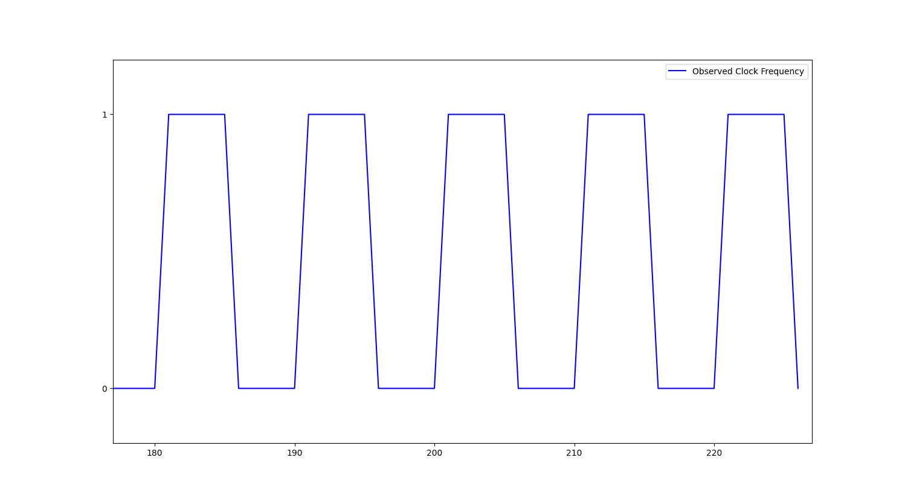
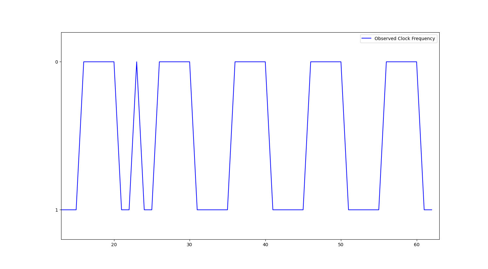
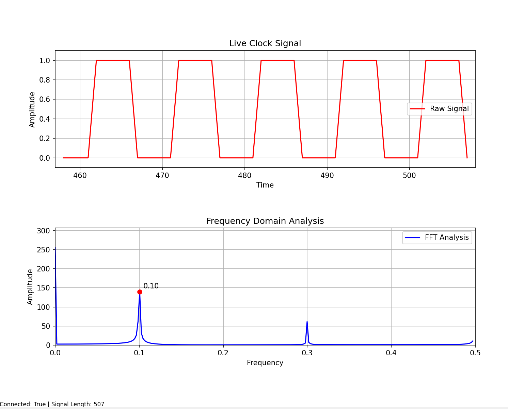
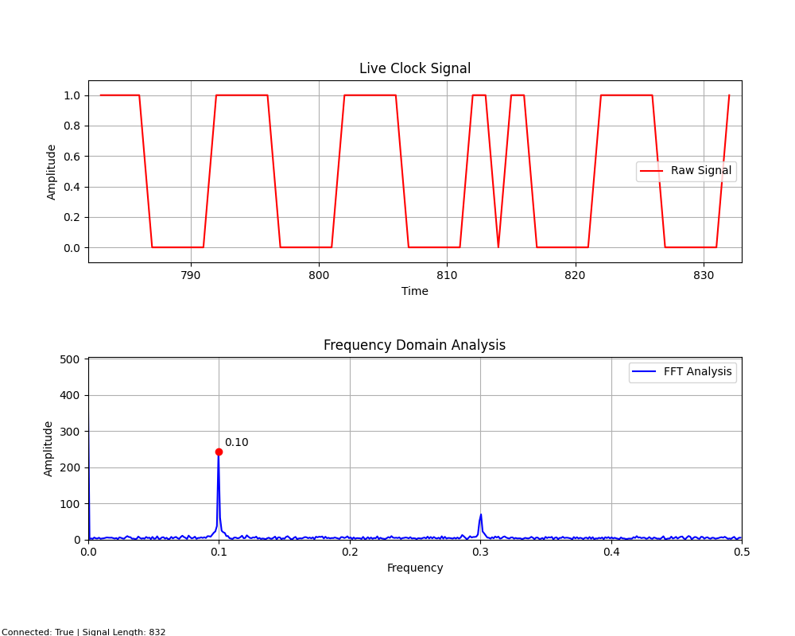
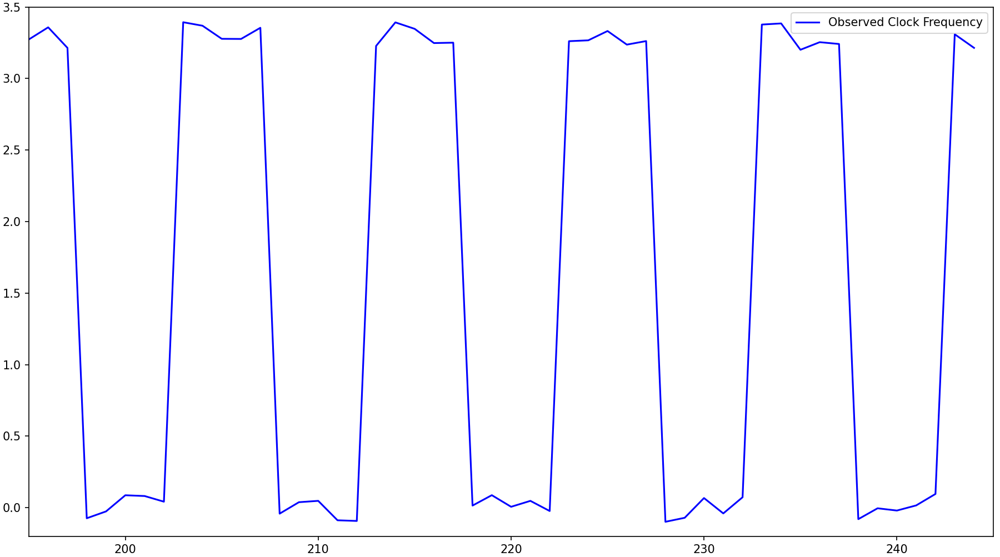
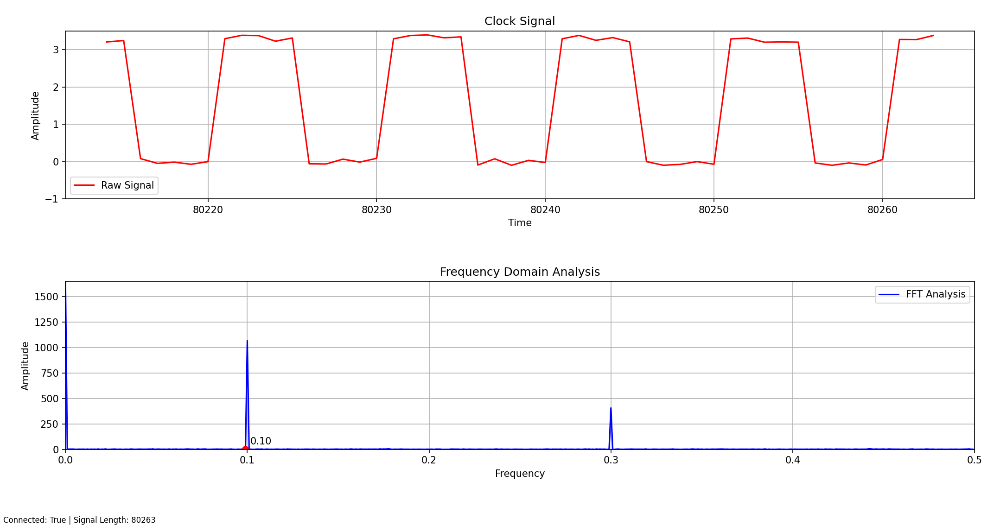
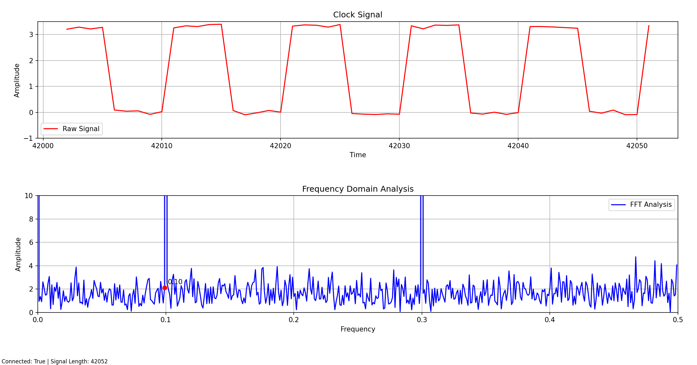
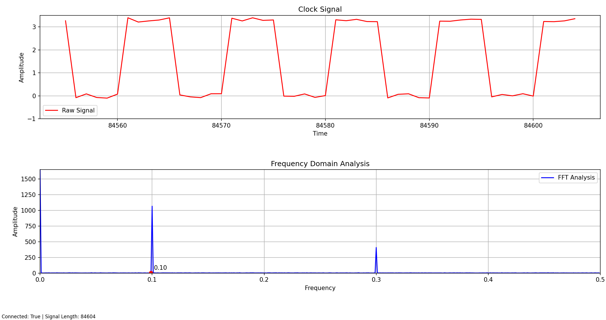
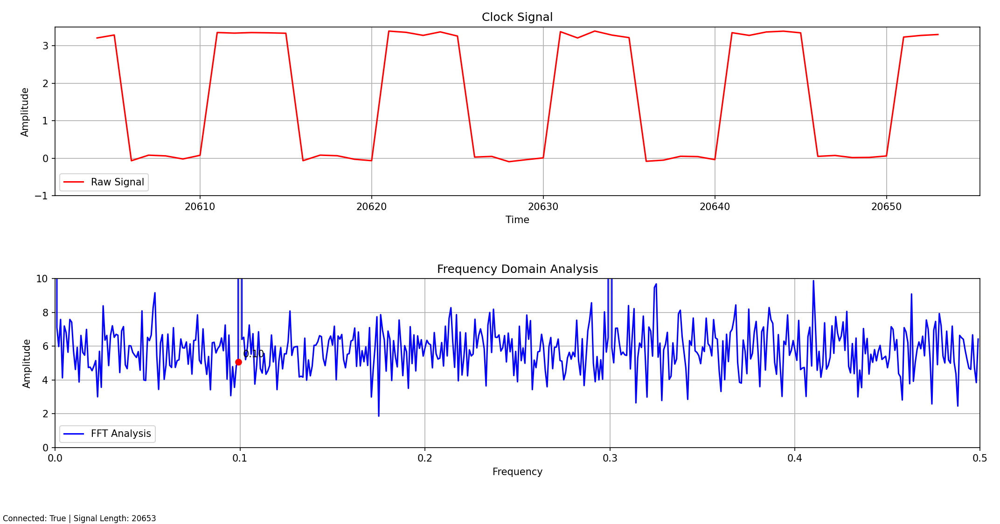

# Hardware Security: A Look at Clock Glitching as a Fault Injection Attack and Possible Detection Methods

This repo contains the files related to the bachelor thesis "Hardware Security: A Look at Clock Glitching as a Fault Injection Attack and Possible Detection Methods". The work done in the thesis is a starting point for future work to be done related to developing a real-time detection method for **Clock Glitching Fault Injections**. A working detection method can be used as a trigger for mitigation techniques, ex. a kill switch. 

Python is used to create a POC. A working POC can be rewritten in a low-level language, ex. C/C++, for placement on microcontrollers.

Libraries used:
- collections
- socket
- json
- threading
- matplotlib.pyplot
- numpy
- matplotlib.animation
- stats (from scipy)
- sys
- argparse
- random
- subprocess


# Instructions
- Clone the repo or download the following files:
  - `clock_freq_server.py`
  - `clock_observer.py`
  - `FFTdata_observer.py`
- Run the program with the following:
  - `python .\clock_freq_server.py`
    - include `-b True` for binary clock signal
    - include `-f True` for jittery floating point clock signal
    - include `-g True` to introduce a single clock glitch
    - include `-gf <frame>` to set which frame to glitch
    - include `-fft True` to automatically run the `FFTdata_observer.py` program
  - example: `python .\clock_freq_server.py -f True -g True -fft True -gf 3001`
- `FFTdata_observer.py` is run automatically when using the `-fft` flag set to `True`
- `clock_observer.py` is run automatically when the `-fft` flag in not set
- Sit back and enjoy
- Close the programs by closing the plot window

## FLAGS
```
"-b",   "--binary",       type=bool,  default=False
"-f",   "--float",        type=bool,  default=False
"-g",   "--glitch",       type=bool,  default=False
"-gf",  "--glitchframe",  type=int,   default=500
"-fft", "--fftanalysis",  type=bool,  default=False
```

## Output of `-h` help flag:
```
python .\clock_freq_server.py -h

Clock frequency server with glitching.

options:
  -h, --help                      show this help message and exit
  -b, --binary        BINARY      Clean binary clock signal.
  -f, --float         FLOAT       Jittery floating point clock signal.
  -g, --glitch        GLITCH      Introduce a clock glitch.
  -gf, --glitchframe  GLITCHFRAME Frame to introduce glitch.
  -fft, --fftanalysis FFTANALYSIS Perform FFT analysis.
```


# Screenshots

## Pure integer signal

### command: `python .\clock_freq_server.py -b True`



---

### command: `python .\clock_freq_server.py -b True -g True -gf 22`



---

### command: `python .\clock_freq_server.py -b True -fft True`



---

### command: `python .\clock_freq_server.py -b True -g True -gf 812 -fft True`



---

## Jittery floating point signal

### command: `python .\clock_freq_server.py -f True`



---

### command: `python .\clock_freq_server.py -f True -fft True`



**zoomed view:**


---

### command: `python .\clock_freq_server.py -f True -g True -gf 20500 -fft True`



**zoomed view:**


---

# Future work

- Automatically alter **Clock Signal - Amplitude** based on desired clock type.
- Add **-z, --zoom** flag with a min/max amplitude range for easing analysis of the FFT output.
- Include the glitched frame value next to **Signal Length:** field in plot.